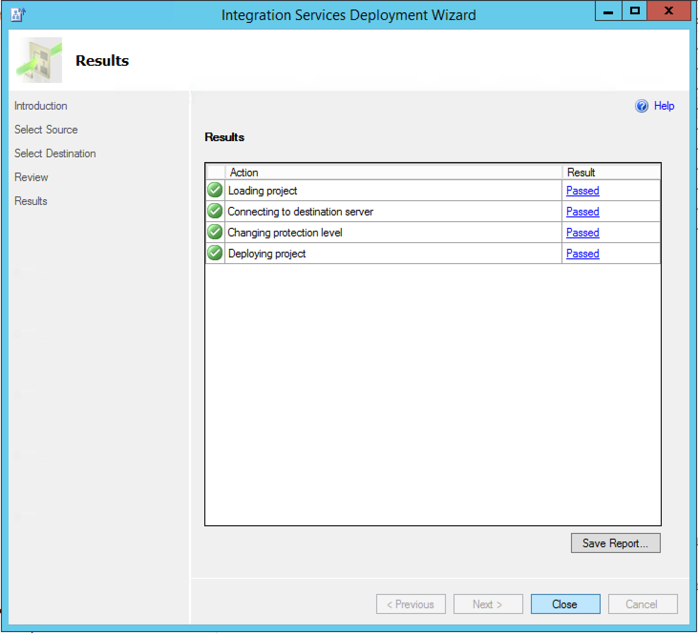
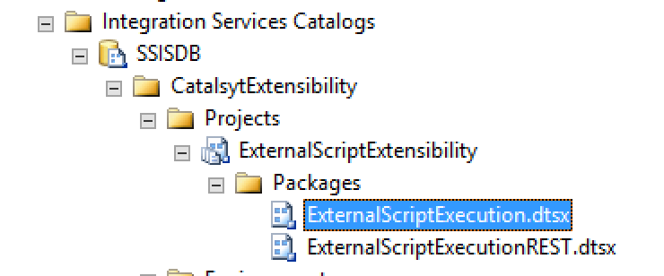

# Machine Learning :: R Extensibility Instructions

- [Initial Steps](#initial-steps)
- [Repeatable Steps For Each Data Mart](#repeatable-steps-for-each-data-mart)
- [Repeatable Steps For Each Destination Entity](#repeatable-steps-for-each-destination-entity)
- [Seed Script Tempaltes](#seed-script-templates)
 
This document instructs the user how to integrate their designated R/Python scripts into the Catalyst loaders.

It begins by installing the required SSIS package and defining new system level attributes. It continues by injecting the new SSIS package into the designated loader step. It concludes by defining the necessary variables for each destination entity.

## ML Model Script Verification

Before installing the extensitibility points, it verify that the user R/Python scripts run on the desired machine. This building block approach avoids confusion later. Only then should a user set up the extensibility points.

1. Verify the R/Python scripts run on the ETL Server. Run them with one of the following options:
    1. an IDE such as **RStudio**, **RGUI**, **Pycharm**, **Spyder**, etc.
    2. the command line using `RScript <YOUR_SCRIPT_NAME>` or `python <YOUR_SCRIPT_NAME>`
2. Run the `helloWorld.R` example file.
3. Verify that a log was created with a hello world note.
4. Run the user script the same way.
5. Verify that a log was created with output from the user script.
6. Delete the logs that were created.
7. Proceed to the extensibility point setup below.

## TODO

- figure out what that field format is
- run stored proc and find out what type it returns
- debug nodes
- check variables
- add breakpoint
- look at V1 loader

### Things to Look For

- Verify that the R/Python interpreter is installed correctly.
- Verify that all needed libraries are installed, including healthcareai.

## ISPAC Installation

The following steps are for the .ispac installation wizard.

1. [Download](https://github.com/HealthCatalyst/SSIS/blob/master/ExternalScriptExtensibility.ispac) and unzip the .ispac file
2. Select **Project Deployment File**

3. Select the desired server

4. Create the folder `CatalsytExtensibility` if it does not exist on the database server

5. Deploy and ensure that all results passed.

6. Open SSMS and verify that these pacakges were installed:


## Extensibility Point Setup

1. Establish local folder on the ETL server. **WHAT IS THIS USED FOR?**
    1. Configure permissions to allow the `EDW loader` user account to read, write, and execute in this directory.

2. If not previously installed, install the ExternalScriptExtensibility.ispac on the ETL server. To find existing extensibility points look in: SSMS > Integration Services Catalog > SSISDB > CatalystExtensions > Projects
    1. Locate inside folder `\SSISDB\CatalsytExtensibility\`
    2. Verify permission to allow the `EDW loader` user account to execute.
    3. Configure `ExternalScriptExecution.dtsx` parameter called `StagingDirectory` with the local folder established in step 1.

3. Seed four new attribute (`RInterpreterPath`, `ExternalScriptType`, `ExternalScriptSourceEntity`, `ExternalRScript`) names into `EDWAdmin.CatalystAdmin.AttributeBASE`. This `AttributeBASE` table can be thought of as a set of keys where values of that key can be set for specific instances of an object elsewhere in `ObjectAttributeBASE`.

    ```sql
    IF NOT EXISTS
        (SELECT * FROM EDWAdmin.CatalystAdmin.AttributeBASE WHERE AttributeNM = 'RInterpreterPath')
    INSERT INTO EDWAdmin.CatalystAdmin.AttributeBASE (AttributeNM, AttributeDSC)
        VALUES ('RInterpreterPath','Local path to RScript.exe')

    IF NOT EXISTS
        (SELECT * FROM EDWAdmin.CatalystAdmin.AttributeBASE WHERE AttributeNM = 'ExternalScriptType')
    INSERT INTO EDWAdmin.CatalystAdmin.AttributeBASE (AttributeNM, AttributeDSC)
        VALUES ('ExternalScriptType','Python or R')

    IF NOT EXISTS
        (SELECT * FROM EDWAdmin.CatalystAdmin.AttributeBASE WHERE AttributeNM = 'ExternalScriptSourceEntity')
    INSERT INTO EDWAdmin.CatalystAdmin.AttributeBASE (AttributeNM, AttributeDSC)
        VALUES ('ExternalScriptSourceEntity','Source entity from which to calculate predictions')

    IF NOT EXISTS
        (SELECT * FROM EDWAdmin.CatalystAdmin.AttributeBASE WHERE AttributeNM = 'ExternalRScript')
    INSERT INTO EDWAdmin.CatalystAdmin.AttributeBASE (AttributeNM, AttributeDSC)
        VALUES ('ExternalRScript','R script that contains functions')
    ```

4. Verify that the new Attribute name keys exist in EDWAdmin.

    ```sql
    SELECT [AttributeID]
          ,[AttributeNM]
          ,[AttributeDSC]
      FROM [EDWAdmin].[CatalystAdmin].[AttributeBASE]
    WHERE AttributeNM IN ('RInterpreterPath', 'ExternalScriptType', 'ExternalScriptSourceEntity', 'ExternalRScript')
    ```

## Repeatable Steps For Each Data Mart

Seed `EDWAdmin.CatalystAdmin.ETLEngineConfigurationBASE` with these values:

|                Column               |                                          Value                                           |
| ----------------------------------- | ---------------------------------------------------------------------------------------- |
| **ExtensionPointNM**                | `OnPostStageToProdLoad`                                                                  |
| **DatamartID**                      | {data mart ID}                                                                           |
| **SSISPackagePathOrSPToExecuteTXT** | `\SSISDB\CatalystExtensibility\ExternalScriptExtensibility\ExternalScriptExecution.dtsx` |
| **IsSSISPackageFLG**                | `1`                                                                                      |
| **ExtensionOwnerNM**                | `Health Catalyst`                                                                        |
| **RunInAsyncModeFLG**               | `0`                                                                                      |
| **Use32BitRuntimeFLG**              | `0`                                                                                      |
| **ExecutionOrderNBR**               | `1`                                                                                      |
| **ActiveFLG**                       | `1`                                                                                      |
| **RequiredParametersTXT**           | `BatchID, TableID`                                                                       |
| **FailsBatchFLG**                   | `1`                                                                                      |

## Repeatable Steps For Each Destination Entity

1.  Seed new destination entity attribute values into `EDWAdmin.CatalystAdmin.ObjectAttributeBASE`

    |             Column             |                                Value                                |
    | ------------------------------ | ------------------------------------------------------------------- |
    | **ExternalScriptType**         | `R`                                                                 |
    | **ExternalScriptSourceEntity** | `SAM.Sample.SampleEntity`                                           |
    | **ExternalRScript**            | {entire contents of the R script file with qualified single quotes} |
    | **RInterpreterPath**           | `C:\Program Files\R\R-3.3.1\Rscript.exe`                            |

2.  Configure dependencies based on need

## Seed Script Templates

### EDWAdmin.CatalystAdmin.ETLEngineConfigurationBASE

```sql
INSERT INTO CatalystAdmin.ETLEngineConfigurationBASE
    (ExtensionPointNM, DatamartID, SSISPackagePathOrSPToExecuteTXT, IsSSISPackageFLG, ExtensionOwnerNM, RunInAsynchModeFLG, Use32BitRuntimeFLG, ExecutionOrderNBR, ActiveFLG, RequiredParametersTXT, FailsBatchFLG)
VALUES
    ('OnPostStageToProdLoad', [DatamartID of SAM], '\SSISDB\CatalystExtensibility\ExternalScriptExtensibility\ExternalScriptExecution.dtsx', 1, 'Health Catalyst', 0, 0, 1, 1, 'BatchID, TableID', 1)
```

### EDWAdmin.CatalystAdmin.ObjectAttributeBASE

```sql
INSERT INTO CatalystAdmin.ObjectAttributeBASE
    (ObjectID,ObjectTypeCD,AttributeNM,AttributeTypeCD,AttributeValueTXT)
VALUES
    ([TableID],'Table','RInterpreterPath','string','C:\Program Files\R\R-3.3.1\bin\Rscript.exe')

INSERT INTO CatalystAdmin.ObjectAttributeBASE
    (ObjectID,ObjectTypeCD,AttributeNM,AttributeTypeCD,AttributeValueTXT)
VALUES
    ([TableID],'Table','ExternalScriptType','string','R')

INSERT INTO CatalystAdmin.ObjectAttributeBASE
    (ObjectID,ObjectTypeCD,AttributeNM,AttributeTypeCD,AttributeValueTXT)
VALUES
    ([TableID],'Table','ExternalScriptSourceEntity','string','[DatabaseNM.SchemaNM.ViewNM]')

INSERT INTO CatalystAdmin.ObjectAttributeBASE
    (ObjectID,ObjectTypeCD,AttributeNM,AttributeTypeCD,AttributeValueLongTXT)
VALUES
    ([TableID],'Table','ExternalRScript','longstring','[Script]')
```
